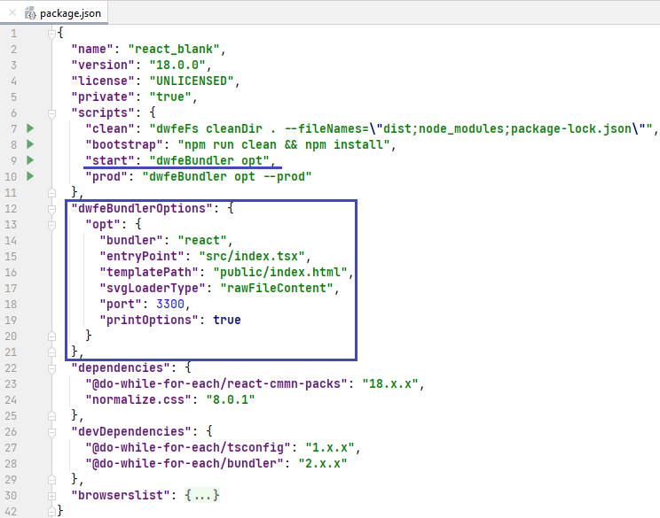

Types of bundlers:

- **react** – a bundler for React.js app
- **node** – a bundler for Node.js app

Example of using **react** bundler:

The `start` script launches the bundler executable file – `dwfeBundler`.  
The `start` script passes the bundler executable file the name of the settings based on which it needs to work. In this example, these are settings named "opt".  
After launch, the bundler searches for its settings according to the following pattern: `package.json` file ➔ object with settings in the predefined field **dwfeBundlerOptions** ➔ settings by the given name.
